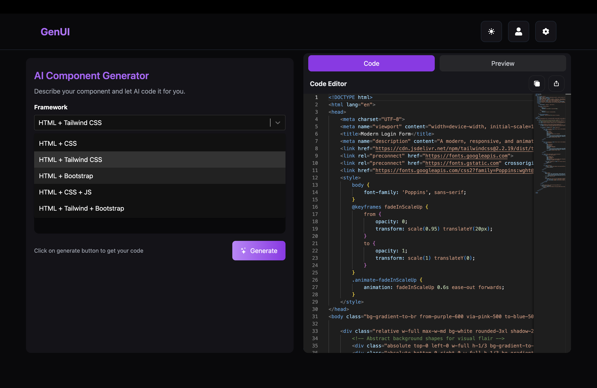
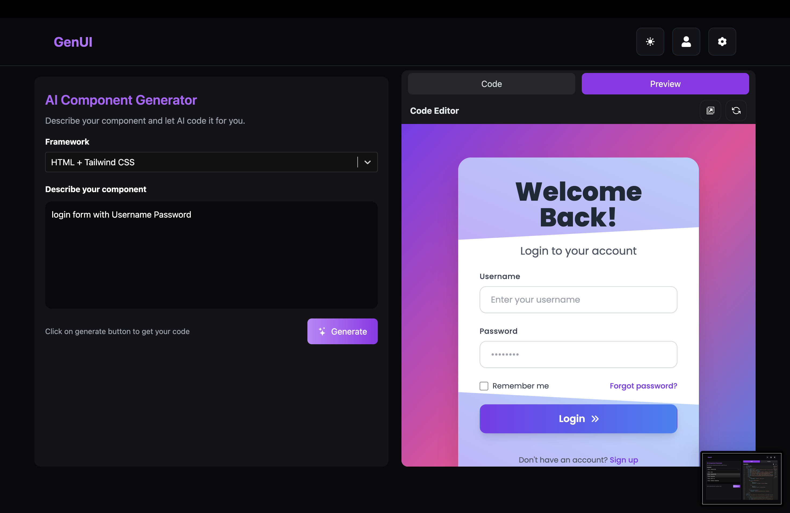

# ⚡ GenUI – AI Component Generator  

🚀 **GenUI** is an AI-powered code generator that helps developers instantly create UI components in different frameworks like **HTML + CSS, Tailwind, Bootstrap, and JS**.  
With a clean interface and live preview, you can generate ready-to-use UI snippets in seconds.  

---

## ✨ Features  

- ⚡ **Multi-Framework Support** – Generate components in:  
  - HTML + CSS  
  - HTML + Tailwind CSS  
  - HTML + Bootstrap  
  - HTML + CSS + JS  
  - HTML + Tailwind + Bootstrap  
- 🖥️ **Live Preview** – Instantly see how your component looks.  
- 📄 **Copy or Download Code** – Get clean, ready-to-use code snippets.  
- 🎨 **Modern UI** – Built with a sleek dark theme.  
- 🔄 **Reusable Components** – Quickly adapt generated code into your projects.  

---

## 🛠️ Tech Stack  

- **Frontend:** React + TailwindCSS  
- **Code Preview:** Rendered using `iframe` with `srcDoc`  
- **State Management:** React Hooks  
- **AI Integration:** (e.g., OpenAI / Gemini API if used)  

---

## 📸 Screenshots  

👉 Replace these with actual screenshots later  

- **UI Home (Framework Selection & Generator)**  
    

- **Generated Component & Code Preview**  
    
 

---

## 🚀 Getting Started  

### 1️⃣ Clone the Repository  
```sh
git clone https://github.com/Bhatiyaamit/AI-Component-Generator-main.git
```
2️⃣ Install Dependencies
```sh
npm install
```
3️⃣ Start the Development Server
```sh
npm run dev
```
